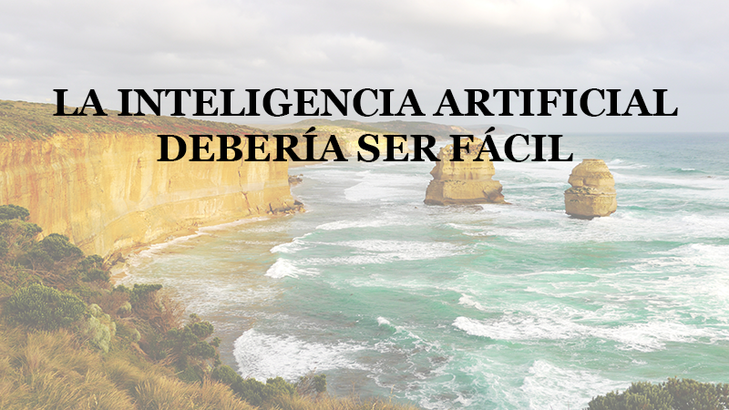

# zAI

zAI (zero-effort Artificial Intelligence) is a Python library that allows any developer to perform high-level artificial intelligence tasks with easy-to-use commands, such that users do not need to have any knowledge about the underlying machine learning models or any of the technicalities involved. If we want to find all the faces in an image, we just need to type:
*myImage.find_faces()*
zAI automatically detects all faces present in *myImage* and returns face locations, facial landmarks, etc. No need of any knowledge about computer vision or machine learning.
In the same way, we can translate text into a different language using *myText.translate()* or perform Optical Character Recognition (OCR) on an image using *myImage.ocr()*.

zAI uses local pre-trained tensorflow models and/or cloud services provided by Google or Microsoft.

zAI is a side project of the R&D Team at [Biometric Vox](http://www.biometricvox.com). We were inspired by [this talk](https://vimeo.com/215418110) from Peter Norvig. We see zAI as a vision of how things should be in the near future.

zAI is compatible with both Python 2 and 3.

## Basic usage

Currently, zAI provides classes to work with text and images. In the future, we plan to include new types of high-level data, such as sound or video. You can find some Jupyter notebooks with tutorials on the *examples* folder.

Here, we will illustrate how to use zAI to:
* Extract the text from an image using OCR
* Translate the text to a different language
* Convert the translated text to voice using speech synthesis

Let's first import the modules to work with image and text data and create a zImage instance from an image file:

```
from zAI import zImage
myImage = zImage('samples/text_over_landscape.png')
myImage.display()
```



To extract the text, we simply use the method ocr. This method will return a zText object with the extracted text:

```
originalText = myImage.ocr()
originalText.display()
```

LA INTELIGENCIA ARTIFICIAL DEBERÍA SER FÁCIL

Now we will translate this text to English. To do this, we use the method translate specifying the desired target language.

```
translatedText = originalText.translate(targetLang='en')
translatedText.display()
```
ARTIFICIAL INTELLIGENCE SHOULD BE EASY

Now that we have our text translated to English, we will convert it into speech:

```
translatedText.to_voice(backend='Microsoft',outputFile='output/speech.wav')
```


## Installation

Dependencies:
* Opencv
* Scipy
* Matplotlib
* Tensorflow
* Requests

To install, do:
```
git clone https://github.com/BiometricVox/zAI
cd zAI
python setup.py install
```

## Development

Any contribution to zAI is very welcome. In particular, as we are not software developers, we will appreciate any help in improving the code quality or the project organization.

zAI is a side project of the R&D Team at [Biometric Vox](http://www.biometricvox.com) and is not an official Biometric Vox product.

Face detection and comparison uses code from: [davidsandberg](https://github.com/davidsandberg/facenet)
Image neural style uses code from: [cysmith](https://github.com/cysmith/neural-style-tf)


